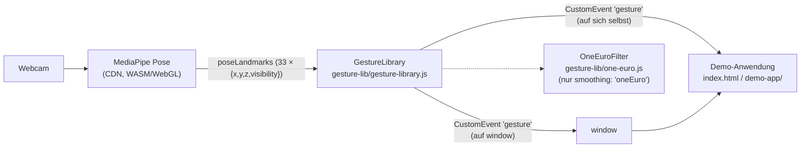
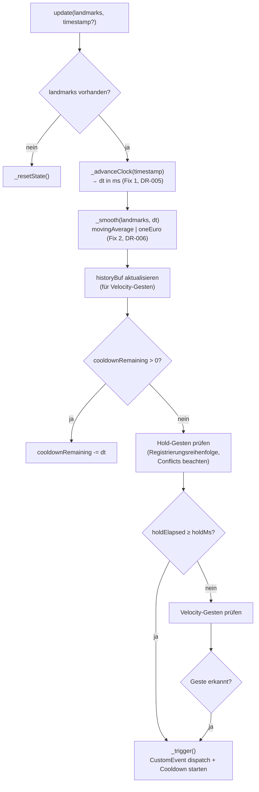

# Architektur

Zwei schlanke Diagramme: der Gesamtaufbau (wer spricht mit wem) und die
`update()`-Pipeline innerhalb der Library, in der beide Vertiefungs-Fixes
greifen (siehe [DR-005](decisions/DR-005-timing-model.md) und
[DR-006](decisions/DR-006-one-euro-smoothing.md)).

## Gesamtaufbau

Alles läuft clientseitig im Browser, kein Backend (siehe README,
„Datenschutz"). MediaPipe liefert pro Frame Pose-Landmarks; die Library
übersetzt sie in Custom Events; die Demo-Anwendung hört nur auf diese Events
und kennt die Library-Internas nicht.

Die Library ist die einzige Stelle, die MediaPipe-Koordinaten kennt; die
Demo-Anwendung kommuniziert ausschließlich über die öffentliche API
(`register`, `useDefaults`, `update`, `disable`/`enable`, `getProgress`,
`addEventListener('gesture', …)`).

## Die `update()`-Pipeline

Ein Aufruf pro Kamera-Frame. Hervorgehoben, wo die beiden Fixes dieser
Vertiefung eingreifen.

**Was sich durch die Vertiefung geändert hat:** Schritt `C` liefert vor dieser
Vertiefung immer einen festen Nominal-Frame-Schritt; Schritt `D` war fest auf
den gleitenden Mittelwert verdrahtet. Beide Schritte sind jetzt austauschbar
(Zeitstempel optional, Glättungsstrategie wählbar) — ohne dass sich an den
Schritten `E`–`L` etwas ändert.
